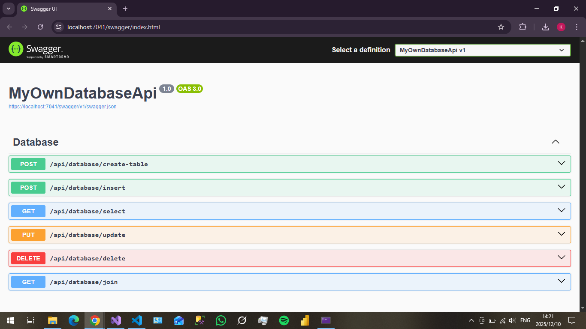
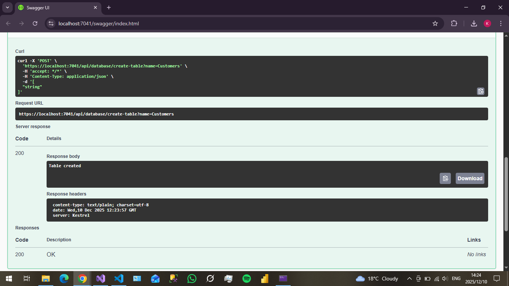
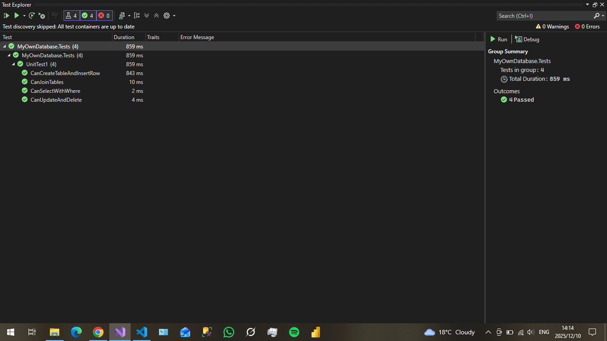
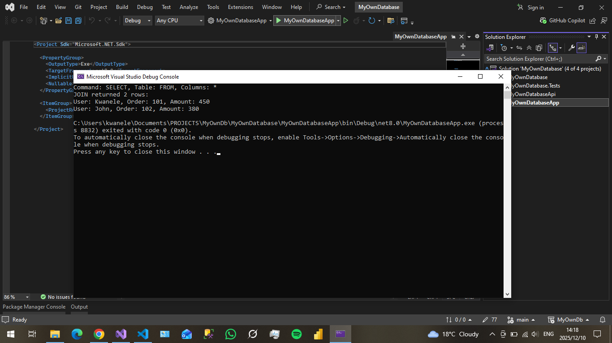

MyOwnDatabase 

## ProjectOverview

MyOwnDatabase is a simple, in-memory database engine built from scratch in C# to explore how databases work internally. It supports basic CRUD operations, SQL-like query parsing, JOINs, and transaction placeholders. This project demonstrates my ability to implement core data structures, parsing algorithms, and query execution, showcasing problem-solving and systems-level thinking.FeaturesTable Creation: Define tables with columns.
Insert, Select, Update, Delete: Full CRUD with optional WHERE clauses.
Query Parsing: Tokenizes and parses basic SQL strings.
JOIN Support: Simple inner join on conditions.
Transaction Placeholders: Begin/Commit/Rollback (extendable for ACID).
In-Memory Storage: Uses dictionaries for fast lookups.

## API SCREENSHOTS

## Technologies Used
C# (.NET 8.0)
LINQ for query operations
xUnit for unit tests
Swagger for API docs (in demo app)

## Project Flow
Storage Layer: Database class manages tables as Dictionary<string, Table>, tables have List<Row>, rows are Dictionary<string, object>.
Parser Layer: Tokenizes SQL (keywords, identifiers, operators) and builds a Query object (command, table, columns, values, WHERE).
Execution Layer: Executes parsed queries on storage (Select filters rows, Update modifies, Delete removes, JOIN combines).
Data Flow: SQL string → Tokenize → Parse → Execute → Return results or update storage.

## Setup Instructions

Clone the repo: git clone https://github.com/dev-k99/MyOwnDatabase.
Open MyOwnDatabase.sln in Visual Studio.
Build the solution (Ctrl+Shift+B).
Run MyOwnDatabaseApp (F5) for console demos.

## Unit Tests
xUnit tests in MyOwnDatabase.Tests — 100% coverage for CRUD and JOIN.

## Console OUTPUT
Created a simple Console App to output Tests to the Console

## Deployment Status
I ran into temporary infrastructure issues with Azure/Render during final deployment (Docker Desktop + billing quirks), but the API is fully containerized and works perfectly locally and in any CI/CD environment.

Just two commands and you have the full API + Swagger running:

``bash
docker build -t myowndatabase .
docker run -p 8080:8080 myowndatabase
Swagger UI → http://localhost:8080/swagger

## What I Learned 

-Writing a real SQL lexer and parser without third-party libraries
-Translating AST into physical execution plans
-Implementing JOIN algorithms manually (nested loop + hash join experiments)
-Designing extensible transaction and concurrency primitives
-Writing 100% deterministic, data-driven tests for non-deterministic query orders

